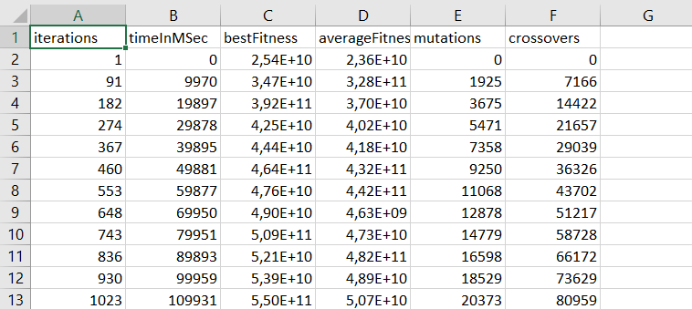
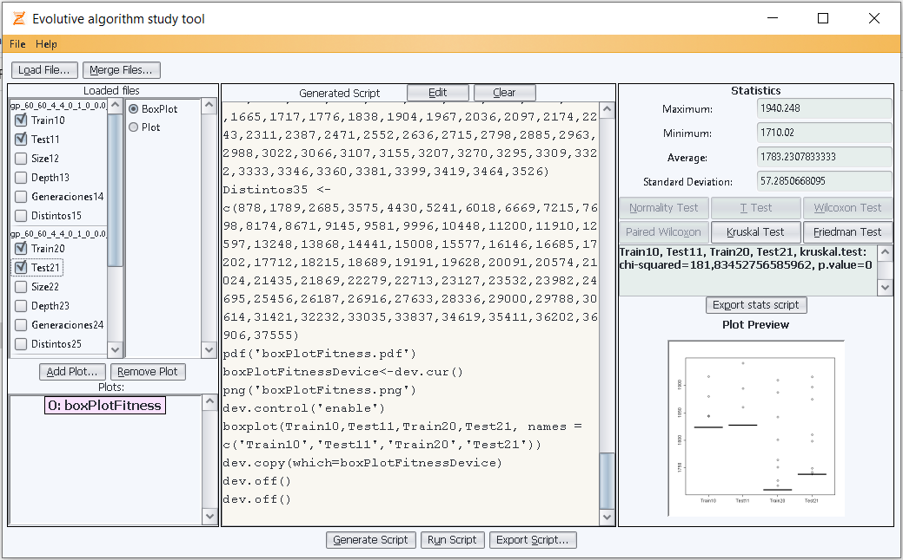

# Evolutionary Algorithm Study Tool
## What's this?
This repository houses the dissertation project for my software engineering degree. It consists of a java written tool, aimed at helping in studying algorithm execution data.

## How does it work?
Main functionality allows the user to plot execution data on boxplots/simple line plots, as well as running statistic tests on loaded data. This is achieved by generating R code scripts which can be executed, exported and edited directly from the GUI in an assisted manner. By default, graphic scripts contain code to export generated plots to *PDF* and *PNG* files.

## Algorithm execution data
Data files must be on *CSV* format, and contain a metric on each column, along with its value list, as shown:

Example data files can be found on both the **"executionResults"** and **"experimentsTSP"** folders.

## Using the tool
As stated previously, *CSV* files can be loaded onto the tool, which will parse them and present to the user a list of the numeric metrics that they contain. User may select the ones they desire, and proceed to run statistic tests or create plots. Once a plotting script is executed, the last generated graph will be show on the preview GUI panel.

There's functionality included to allow for merging of data files, either by computing the average values of all data contained on these files (i.e. useful in cases where the same algorithm is ran a number of times to measure average performance), or by selecting one row of data from each input file.

## Additional goodies...
This project also contains code for an evolutive algorithm that solves the *Travelling Salesman Problem*, as well as an *"Algorithm"* framework class that aims to aid in recording execution data from any kind of algorithm. These have been used together during development to generate data files that are compatible and ready to use with the algorithm study tool.
This genetic algorithm and said framework can be found on the **"src/tsp"** package folder. TSP instances of varying sizes used by the algorithm can be found on the **"resources/tspInstances"** folder.
